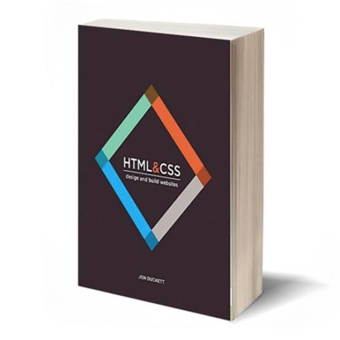
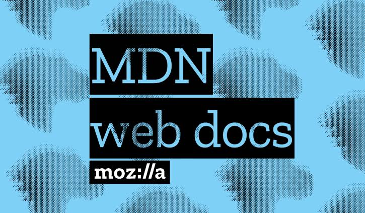
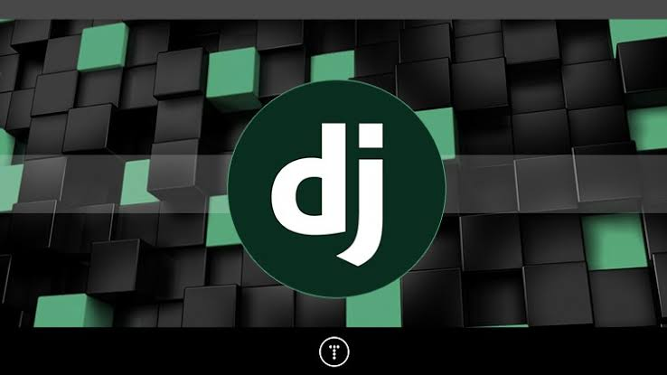
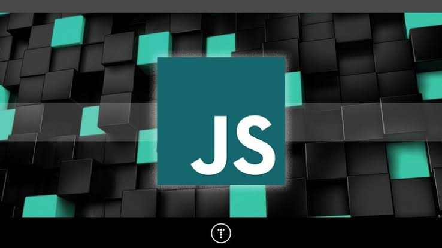

Going back to learning the basics and gaining a solid foundation in HTML & CSS whilst trying to avoid wasting time.

<!-- end -->

## Back To Basics

It’s so easy to want to be that expert web developer straight off the bat, one google search leads to another and sure enough you’re 2 hours into your allotted study time with absolutely no progress. What a waste of time!

Time can be your worst enemy. I find myself constantly browsing the web with the same questions on the daily, which JavaScript framework is best?? React vs Angular vs Vue? Best backend framework? Blah blah blah. Always trying to implement the latest and greatest things without barely even understanding the basic fundamentals behind it all. So that’s why I am going back to the basics.

Back to the drawing boards i go. Being an aspiring web developer, I (like many others) find it very hard to squeeze in the time on a daily to knuckle down and learn, understand and retain the information needed to advance my web dev career. I find myself in a constant viscous cycle of always having to do a refresher of the basics, which in turn takes away valuable time. 

Everyday I intend to at least set aside 30mins to do some studies, stay active and focused on the task at hand. Hopefully if all comes to fruition, within 6-12 months my goal is to be proficient enough to start my own freelancing business. That is the end game but for now the main focus is consistent efforts everyday. The struggle is real my friends and you are all invited to follow along in this journey with me. 

The first step on this journey is learning HTML5 & CSS. Some resources I am currently utilising and would highly recommend are:

###HTML & CSS by Jon Duckett.

This book along with the JavaScript book by Jon are an excellent supplement to help you to begin learning and understanding the basics of web development.

###Mozilla Developer Network

MDN website is top notch. Highly recommended by a lot of professionals. Really my goto for learning all there is to learn about web dev. 

###Udemy.com

By far my favourite platform for thorough courses which have helped me kickstart my journey. 
My favourite tutor is Brad Traversy, I currently have 3 of his courses.

###Python Django dev to deployment - Completed. 

This course focused on utilising the python language with the Django framework to create a real estate web application. I learnt a lot from this course and gained a greater appreciation for backend development. Also I am a massive fan of Python, so I will definitely be going back to this language / framework when I tackle backend development further down the track. 

###Modern HTML & CSS from the beginning (including SASS) - Work In Progress.

I’m currently sitting at about 10% completion of this course. Finished the HTML sandbox section and am working on the CSS sandbox section before we start using what we have learnt in projects. Rate this course 5 stars and look forward to completing it. 

###Modern JavaScript from the beginning - Next in line.

This course will is on my list to complete after I finish the HTML & CSS course. Once I have learnt vanilla JavaScript my next step will be to use a framework. 

For now it’s full steam ahead learning HTML & CSS so stay tuned to follow my progress as I will hopefully be able to share some of the knowledge I gain with you all. 
